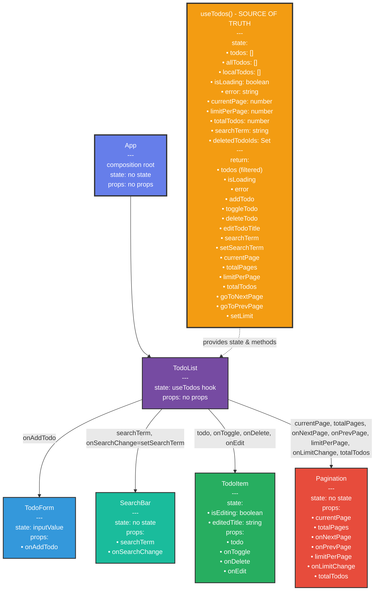

## Component Tree

### Пояснення діаграми

- **useTodos**:
  - **Роль**: Кастомний хук, який є "джерелом правди" (source of truth) для управління станом і логікою списку завдань. Інкапсулює всю логіку роботи з даними, включаючи fetching, CRUD операції, пошук, пагінацію та управління локальними завданнями.
  - **State**:
    - `todos`: Масив об'єктів, що представляє поточну сторінку завдань (з API).
    - `allTodos`: Повний масив всіх завдань з API (для функціоналу пошуку).
    - `localTodos`: Масив локально створених завдань (які ще не відправлені на сервер).
    - `isLoading`: Булеве значення, яке вказує, чи дані завантажуються.
    - `error`: Рядок, що містить повідомлення про помилку (якщо є).
    - `currentPage`: Поточна сторінка пагінації.
    - `limitPerPage`: Кількість елементів на сторінці.
    - `totalTodos`: Загальна кількість завдань (з урахуванням видалених).
    - `searchTerm`: Рядок для фільтрації завдань за текстом.
    - `deletedTodoIds`: Set ID видалених завдань (для синхронізації з API).
  - **Return**: Повертає:
    - `todos`: Відфільтрований список завдань (з урахуванням пошуку та локальних завдань).
    - `isLoading`: Стан завантаження.
    - `error`: Повідомлення про помилку (якщо є).
    - `addTodo`: Функція для додавання нового завдання локально.
    - `toggleTodo`: Функція для зміни статусу завдання (виконано/не виконано).
    - `deleteTodo`: Функція для видалення завдання (з API або локально).
    - `editTodoTitle`: Функція для редагування назви завдання (PUT запит до API).
    - `searchTerm`: Поточний термін пошуку.
    - `setSearchTerm`: Функція для оновлення терміну пошуку.
    - `currentPage`: Поточна сторінка.
    - `totalPages`: Загальна кількість сторінок.
    - `limitPerPage`: Кількість елементів на сторінці.
    - `totalTodos`: Загальна кількість завдань.
    - `goToNextPage`: Функція для переходу на наступну сторінку.
    - `goToPrevPage`: Функція для переходу на попередню сторінку.
    - `setLimit`: Функція для зміни кількості елементів на сторінці.
  - **Зв'язок**: Надає стан і методи до компонента `TodoList` через композицію.

- **App**:
  - **Роль**: Кореневий компонент, який є точкою композиції (composition root) додатка.
  - **State**: Не має власного стану (stateless).
  - **Props**: Не отримує пропсів.
  - **Рендерить**: Лише компонент `TodoList`.
  - **Зв'язок**: Є батьківським компонентом для `TodoList`, ініціалізуючи структуру додатка та забезпечуючи єдину точку входу.

- **TodoList**:
  - **Роль**: Контейнерний компонент (Container Component), що відповідає за оркестрацію всього функціоналу додатка. Отримує дані та методи з хука `useTodos` і розподіляє їх між дочірніми презентаційними компонентами.
  - **State**: Використовує хук `useTodos` для отримання стану та методів. Не має власного стану для бізнес-логіки.
  - **Props**: Не отримує зовнішніх пропсів.
  - **Рендерить**:
    - `TodoForm` для додавання нових завдань.
    - `SearchBar` для фільтрації завдань за текстом.
    - Список `TodoItem` для відображення кожного завдання з відфільтрованого масиву `todos`.
    - `Pagination` для навігації між сторінками (показується тільки коли немає активного пошуку).
    - `LoadingSpinner` при завантаженні даних.
    - `ErrorMessage` при виникненні помилок.
  - **Callbacks**:
    - Передає `onAddTodo={addTodo}` до `TodoForm` для додавання нового завдання.
    - Передає `searchTerm` та `onSearchChange={setSearchTerm}` до `SearchBar` для управління пошуком.
    - Передає `todo`, `onToggle={toggleTodo}`, `onDelete={deleteTodo}` та `onEdit={editTodoTitle}` до кожного `TodoItem`.
    - Передає параметри пагінації (`currentPage`, `totalPages`, `onNextPage={goToNextPage}`, `onPrevPage={goToPrevPage}`, `limitPerPage`, `onLimitChange={setLimit}`, `totalTodos`) до `Pagination`.

- **TodoForm**:
  - **Роль**: Презентаційний компонент (Presentational Component) для введення та додавання нових завдань.
  - **State**: `inputValue` — рядок, що зберігає текст із поля введення (локальний стан форми).
  - **Props**:
    - `onAddTodo`: Callback функція для додавання нового завдання.
  - **Callback**: При submit форми викликає `onAddTodo(inputValue)`, передаючи текст нового завдання до `TodoList`, який використовує `addTodo` з `useTodos`. Після успішного додавання очищає поле введення.

- **SearchBar**:
  - **Роль**: Презентаційний компонент для фільтрації завдань за текстом.
  - **State**: Не має власного стану (controlled component).
  - **Props**:
    - `searchTerm`: Поточне значення пошукового запиту.
    - `onSearchChange`: Callback функція для оновлення терміну пошуку.
  - **Callbacks**:
    - Викликає `onSearchChange(e.target.value)` при введенні тексту в поле пошуку.
    - Викликає `onSearchChange("")` при натисканні кнопки очищення пошуку.

- **TodoItem**:
  - **Роль**: Презентаційний компонент, що відображає окреме завдання та дозволяє взаємодіяти з ним. Управляє власним станом редагування.
  - **State**:
    - `isEditing`: Булеве значення, що вказує, чи знаходиться завдання в режимі редагування.
    - `editedTitle`: Тимчасове значення відредагованого тексту завдання.
  - **Props**:
    - `todo`: Об'єкт завдання (містить id, todo, completed, userId).
    - `onToggle`: Callback для зміни статусу завдання (виконано/не виконано).
    - `onDelete`: Callback для видалення завдання.
    - `onEdit`: Callback для збереження відредагованого заголовка завдання.
  - **Callbacks**:
    - Викликає `onToggle(todo.id)` при зміні статусу завдання через checkbox.
    - Викликає `onDelete(todo.id)` при натисканні кнопки видалення.
    - Викликає `onEdit(todo.id, editedTitle)` при збереженні відредагованого заголовка (Enter або кнопка "Save").
  - **Логіка редагування**:
    - Перемикає локальний стан `isEditing` при натисканні кнопки "Edit".
    - Показує input замість статичного тексту в режимі редагування.
    - Підтримує збереження (Enter/кнопка Save) та скасування (Escape/кнопка Cancel).

- **Pagination**:
  - **Роль**: Презентаційний компонент для навігації між сторінками списку завдань.
  - **State**: Не має власного стану (stateless).
  - **Props**:
    - `currentPage`: Поточний номер сторінки.
    - `totalPages`: Загальна кількість сторінок.
    - `onNextPage`: Callback для переходу на наступну сторінку.
    - `onPrevPage`: Callback для переходу на попередню сторінку.
    - `limitPerPage`: Поточна кількість елементів на сторінці.
    - `onLimitChange`: Callback для зміни кількості елементів на сторінці.
    - `totalTodos`: Загальна кількість завдань.
  - **Callbacks**:
    - Викликає `onNextPage()` при натисканні кнопки "Наступна".
    - Викликає `onPrevPage()` при натисканні кнопки "Попередня".
    - Викликає `onLimitChange(Number(e.target.value))` при зміні значення в селекті кількості елементів.
  - **UI логіка**:
    - Кнопка "Попередня" disabled на першій сторінці.
    - Кнопка "Наступна" disabled на останній сторінці.
    - Показує діапазон елементів (наприклад, "Показано 1-10 з 254").

### Потік даних (Data Flow)

**Downward (Props)**:
- Стан і методи з `useTodos` → `TodoList` (через виклик хука)
- Props з `TodoList` → `TodoForm`, `SearchBar`, `TodoItem`, `Pagination` (через атрибути компонентів)

**Upward (Callbacks)**:
- Події користувача в `TodoForm`, `SearchBar`, `TodoItem`, `Pagination` → Callbacks → `TodoList` → Методи з `useTodos` → Оновлення стану → Re-render

**Особливості**:
- Всі CRUD операції, пошук і пагінація інкапсульовані в `useTodos`
- `TodoList` виступає як контейнер, що з'єднує логіку (з хука) з UI (презентаційні компоненти)
- Локальні завдання (`localTodos`) об'єднуються з завданнями з API для безшовного UX
- Пошук працює на стороні клієнта по всьому масиву `allTodos`
- Пагінація використовує API параметри `limit` і `skip` для ефективного завантаження даних

### Використані патерни проектування

#### 1. **Custom Hook Pattern**
- **Де використано**: `useTodos`
Інкапсуляція складної логіки управління станом, side effects та бізнес-логіки в окремий переповторно використовуваний хук. Це дозволяє абстрагувати логіку роботи з даними від UI компонентів.

#### 2. **Container/Presentational Pattern**
- **Де використано**:
  - **Container**: `TodoList` (розумний компонент, що управляє даними)
  - **Presentational**: `TodoForm`, `SearchBar`, `TodoItem`, `Pagination`, `LoadingSpinner`, `ErrorMessage` (тупі компоненти для відображення)
Розділення компонентів на два типи:
  - Контейнери: відповідають за логіку, отримують дані, управляють станом
  - Презентаційні: відповідають тільки за відображення, отримують дані через props

#### 3. **Composition Pattern**
- **Де використано**: `App` → `TodoList` → дочірні компоненти
Побудова складних UI через композицію простих компонентів. `App` виступає як composition root, що ініціалізує структуру додатка.

#### 4. **Props Drilling Pattern**
- **Де використано**: Передача callbacks від `TodoList` до всіх дочірніх компонентів
Передача даних і callback функцій через props від батьківського компонента до дочірніх. Всі інтеракції користувача піднімаються вгору через callbacks.

#### 5. **Controlled Components Pattern**
- **Де використано**: `TodoForm` (inputValue), `SearchBar` (searchTerm), `TodoItem` (editedTitle в режимі редагування)
React контролює стан форм через state. Значення input'ів керуються через `value` та `onChange`.

#### 6. **Optimistic UI Updates Pattern**
- **Де використано**: `toggleTodo`, `editTodoTitle`, `deleteTodo` в `useTodos`
Оновлення UI негайно (оптимістично), перед отриманням відповіді від сервера. У разі помилки - відкат до попереднього стану.

#### 7. **Error Boundary Pattern (Implicit)**
- **Де використано**: `error` state в `useTodos` + `ErrorMessage` компонент
Централізована обробка помилок через стан. Всі помилки з API calls ловляться та зберігаються в `error` state, який потім відображається через `ErrorMessage`.

#### 8. **Loading State Pattern**
- **Де використано**: `isLoading` state + `LoadingSpinner` компонент
Управління станом завантаження для асинхронних операцій. Показує спінер під час fetching даних.

#### 9. **Separation of Concerns (API Layer)**
- **Де використано**: `src/api/todosApi.js`
Винесення всієї логіки HTTP запитів до окремого модуля. Використання axios для створення API клієнта з базовою конфігурацією.

#### 10. **Immutable State Updates Pattern**
- **Де використано**: Всі update операції в `useTodos` (використання `map`, `filter`, spread operator)
Створення нових копій стану замість мутації існуючого. Використання `.map()` для оновлень, `.filter()` для видалень, spread operator для об'єднання.

#### 11. **Client-Side Filtering Pattern**
- **Де використано**: `filteredTodos` в `useTodos`
Фільтрація даних на стороні клієнта без додаткових запитів до сервера. Підтримка real-time пошуку по `searchTerm`.

#### 12. **Pagination with API Integration Pattern**
- **Де використано**: `currentPage`, `limitPerPage`, `skip` в `useTodos`
Серверна пагінація через API параметри `limit` і `skip`. Клієнт запитує тільки необхідну порцію даних.

#### 13. **Hybrid Local/Remote State Pattern**
- **Де використано**: `localTodos` + `todos` (з API) в `useTodos`
Об'єднання локально створених завдань з завданнями з API. Локальні завдання мають ID > 1000000000000 для розрізнення.

#### 14. **Conditional Rendering Pattern**
- **Де використано**: В `TodoList` - умовне відображення спінера, помилок, порожнього стану, пагінації
Відображення різних компонентів залежно від стану додатка (завантаження, помилка, порожній список, тощо).

#### 15. **Event Handler Pattern**
- **Де використано**: Всі `handle*` функції в компонентах (`handleSubmit`, `handleSave`, `handleCancel`, `handleKeyPress`)
Винесення логіки обробки подій в окремі функції з префіксом `handle`.
